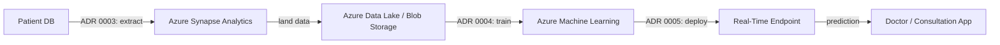

# End-to-End ML Solution Architecture

Data flow from source patient data to real-time prediction serving. See `docs/adrs/` for the decisions behind each stage.

1. **Patient DB** — source of truth for patient records (pregnancies, age, BMI, ...).
2. **Azure Synapse Analytics** — moves and transforms data out of the patient DB (ADR 0003).
3. **Azure Data Lake / Blob Storage** — governed landing zone for privacy-sensitive data (ADR 0002).
4. **Azure Machine Learning** — trains and tracks models against the landed data (ADR 0004).
5. **Real-Time Endpoint** — always-on managed online endpoint serving individual, on-demand predictions during consultations (ADR 0005).
